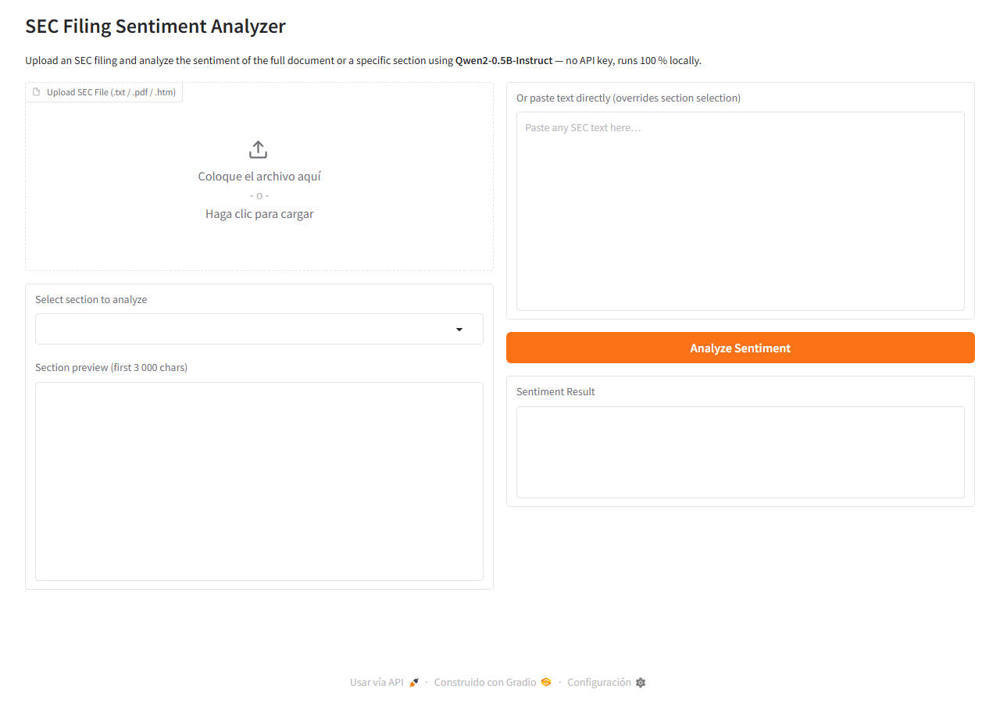

# SEC Filing Sentiment Analyzer

A local web app that analyzes the sentiment of SEC filings using **Qwen2-0.5B-Instruct**.  
No API key required — the model runs entirely on your machine.

## Screenshot



## Features

- Upload an SEC file (`.txt`, `.pdf`, or `.htm`)
- Auto-detects named sections (Item 1, Item 1A, Item 7, …)
- Analyze the **full document** or a **specific section**
- Paste text directly as an alternative to uploading
- Sentiment output: **Positive / Negative / Neutral** with a brief reason

## Requirements

- Python 3.9+
- ~1 GB disk space for the model (downloaded automatically on first run)

## Setup & Run

```bash
# 1. Clone the repo
git clone https://github.com/<your-username>/sec-sentiment-app.git
cd sec-sentiment-app

# 2. Install dependencies
pip install -r requirements.txt

# 3. Run the app
python app.py
```

The app will open at `http://127.0.0.1:7860` in your browser.

## How it works

1. The uploaded file is parsed to plain text (HTML tags stripped for `.htm` files).
2. Common SEC section headings (`Item X …`) are detected and offered as a dropdown.
3. The selected text is sent to **Qwen2-0.5B-Instruct** via a zero-shot prompt asking for Positive / Negative / Neutral sentiment plus a one-sentence reason.
4. Long texts are truncated to 512 tokens before being passed to the model.

> **Note:** Qwen2-0.5B is a very small model; sentiment accuracy on financial text may be limited.

## Model

[Qwen/Qwen2-0.5B-Instruct](https://huggingface.co/Qwen/Qwen2-0.5B-Instruct) — downloaded automatically from Hugging Face on first run.
